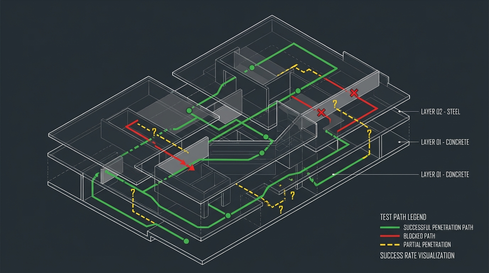

# Pobi CLI

[](https://discord.gg/zwUVa3E7KT)
[](VERSION)

**Autonomous pentesting agent using feedback-driven iteration**
Achieves **~80%** on the full XBOW validation benchmark with **Kimi K2.5** at **~US$122** total API cost for that end-to-end run, with a model-agnostic architecture that supports other deployable LLMs.


*Like the project or want to know more? Feel free to [reach out](#contact)!*

> [!WARNING]
> **Active Development**: This project is undergoing active development. Core features are stable and production-ready, but we're continuously improving the interface, workflows, and adding new capabilities based on user feedback. Check out the [roadmap](#current-status--roadmap) or open a issue for a future issue. 

> [!NOTE]
> For discussions, research, and feature ideas, join the community Discord: [Pobi CLI Discord](https://discord.gg/zwUVa3E7KT).


📄 [Read Technical Deep Dive](https://xoxruns.medium.com/feedback-driven-iteration-and-fully-local-webapp-pentesting-ai-agent-achieving-78-on-xbow-199ef719bf01) | 📊 [Benchmark Results (use VScode ANSI colors to view)](https://github.com/xoxruns/pobi/tree/main/benchmarks-results/xbow)

## Table of Contents

- [What is Pobi CLI?](#what-is-pobi)
- [Architecture Summary](#architecture-summary)
- [Benchmark Results](#benchmark-results)
- [Core Analysis Capabilities](#core-analysis-capabilities)
- [Models tested until now](#models-tested-until-now)
- [Custom Pentesting Tools](#-custom-pentesting-tools)
- [🌐 Web Console](#-web-console)
- [Quick Start](#quick-start)
  - [Prerequisites](#prerequisites)
  - [Installation](#installation)
  - [First Run](#first-run)
  - [Development](#development)
- [Usage Examples](#usage-examples)
- [Commands](#commands)
- [Model Settings and Configuration](#model-settings-and-configuration)
- [Technology Stack](#technology-stack)
- [Current Status & Roadmap](#current-status--roadmap)
- [Contributing](#contributing)
- [Citation](#citation)
- [Contact](#contact)

---

## What is Pobi CLI?

Pobi CLI is an autonomous web application penetration testing agent that uses feedback-driven iteration to adapt exploitation strategies. When standard tools fail, it generates custom Python payloads, observes responses, and iteratively refines its approach until breakthrough.

**Key features:**
- Fully local execution (no cloud dependencies, zero data exfiltration)
- Model-agnostic design (works with any deployable LLM)
- Custom sandboxed tools (Playwright, Docker, WebAssembly)
- ADaPT-based architecture with supervisor-subagent hierarchy
- Confidence-based decision making (fail <20%, expand 20-60%, refine 60-80%, validate >80%)

**Benchmark results:** **~80%** on the XBOW validation suite with **Kimi K2.5** at **~US$122** total cost for the full benchmark run, including blind SQL injection exploits where other agents achieved 0%.

[Read the architecture breakdown in our technical article →](https://xoxruns.medium.com/feedback-driven-iteration-and-fully-local-webapp-pentesting-ai-agent-achieving-78-on-xbow-199ef719bf01)

## Architecture Summary

The agent uses a two-phase approach (reconnaissance → exploitation) with a supervisor-subagent hierarchy:

**Supervisor**: Maintains high-level goals, delegates to specialized subagents
**Subagents**: Focused toolsets (Requester for HTTP, Shell for commands, Python for payloads)
**Policy**: Confidence scores (0-1.0) determine whether to fail, expand, refine, or validate

**Key innovation:** When standard tools fail, the agent generates custom exploitation scripts and iterates based on observed feedback—solving challenges like blind SQL injection where static toolchains achieve 0%.

[Read full architecture details →](https://xoxruns.medium.com/feedback-driven-iteration-and-fully-local-webapp-pentesting-ai-agent-achieving-78-on-xbow-199ef719bf01)


## Benchmark Results

> **Note**: To visualize the benchmark results properly, install an ANSI colors extension (e.g., [ANSI Colors](https://marketplace.visualstudio.com/items?itemName=iliazeus.vscode-ansi) for VS Code) to render the rich output.

> **Setup**: Before running benchmark scripts, clone the XBOW validation suite into place:
> ```sh
> git clone https://github.com/xoxruns/validation-benchmarks-xbow.git benchmarks/xbow/validation-benchmarks-xbow
> ```

Evaluated on XBOW's 104-challenge validation suite (black-box mode, January 2026).

**Models latest results:** Kimi K2.5 (~80%, ~US$122 for the full 104-challenge XBOW validation run), **GLM-5 (Zhipu AI)**—also very strong in practice.

Strong performance: XSS (91%), Business Logic (86%), SQL injection (83%), IDOR (80%)
Perfect scores: GraphQL, SSRF, NoSQL injection, HTTP method tampering (100%)

## Core Analysis Capabilities

The framework focuses on **intelligent security analysis** through:

- **🔍 Taint Analysis**: Automated tracking of data flow from sources to sinks
- **🎯 Source/Sink Detection**: Intelligent identification of entry points and vulnerable functions
- **🔗 Contextual Tool Integration**: Smart connection to specialized tools for testing complex logic patterns
- **🧠 AI-Driven Reasoning**: Context-aware analysis that mimics expert security thinking

## Models tested until now

The following models have been tested with Pobi CLI. Compatibility and performance may vary:

**Moonshot AI**
- **Models**: `Kimi-K2-Thinking`, `Kimi-K2.5`
- **Status**: Works excellently across all features
- **Notes**: Reliable performance at every step of the workflow. **Kimi K2.5** achieved **~80%** on the full XBOW validation benchmark at **~US$122** total cost for that run.

**Anthropic**
- **Models**: Claude Sonnet 4.5, Claude 3 Opus, Claude 3 Haiku
- **Status**: Powerful models with excellent results
- **Notes**: Properly extracts results and token usage information. Recommended for production use.

**Zhipu AI**
- **Models**: `GLM-5` (and related GLM series where supported)
- **Status**: Works very well with Pobi CLI
- **Notes**: **GLM-5** from Zhipu AI is **really good** for this workflow—among the standouts alongside Kimi and Claude for reasoning and tool use.

**DeepSeek**
- **Models**: DeepSeek models via various providers
- **Status**: Functional but with limitations
- **Notes**: Models work for general reasoning but struggle with shell command execution and HTTP payload generation. May require architecture adjustments or model fine-tuning for optimal performance.

**OpenAI**
- **Models**: GPT-5.X, Codex variants
- **Status**: Under investigation
- **Notes**: Some issues observed with tool execution via LiteLLM. Requires further investigation before definitive compatibility assessment.

> **Tip**: For best results, we recommend Moonshot AI (Kimi), Anthropic (Claude), or **Zhipu AI (GLM-5)**—all thoroughly exercised on Pobi CLI and strong across the workflow.

## 🔧 Custom Pentesting Tools

- **Webapp-Specific Tooling**: Custom tools designed specifically for web application penetration testing
- **Authentication Handling**: Built-in support for session management, cookies, and auth flows
- **Fine-Grained Testing**: Precise control over individual requests and parameters
- **Payload Generation**: AI-powered payload creation tailored to target context
- **Automated Payload Testing**: Generate, inject, and validate payloads in a single workflow

---

## 🌐 Web Console

Pobi ships a built-in **Web Console** (the `pobi.web_console` package) — a browser-based control plane for the autonomous agent. It streams live agent events over SSE, lets you launch scans against a target, inspect findings, review the audit trail, and approve/reject sensitive tool calls in real time.

**Features**
- Live event stream (agent start, task creation, tool calls, execution records, confidence updates, validation results)
- Launch scans with a natural-language prompt against any target URL
- Findings view with severity, confidence, and validation status
- Append-only audit log of every action
- Human-in-the-loop approval gate for sensitive tool calls

**Run it**

```bash
# install the package with the optional web extra
pip install ".[web]"        # from the pobi/ package directory
# or, with uv:
uv sync --extra web

# launch the console, then open http://localhost:8000
pobi-web-console
```

The console talks to the local daemon (`pobi-jsonrpc-server`). If the daemon isn't reachable it transparently falls back to a **simulation mode** so you can explore the UI immediately. See [`pobi/src/pobi/web_console/README.md`](pobi/src/pobi/web_console/README.md) for configuration and environment variables.

## Quick Start

### Prerequisites
- Docker (required)
- curl (for installation script)

### Installation

This repository ships a Python-package installer (`install.sh`) that builds the project into an isolated virtual environment and links the console scripts onto your `PATH`. It installs the optional **Web Console** extra by default.

**Recommended — clone and install:**

```bash
git clone https://github.com/Sexisnull/pobi.git
cd pobi
./install.sh                  # -> ~/.cache/pobi/venv, scripts linked to ~/.local/bin
./install.sh --launch         # install and immediately launch the Web Console
```

Variants:
```bash
./install.sh --install-dir /opt/pobi   # custom virtualenv location
./install.sh --no-web                   # skip the Web Console extra
```

The installer will:
- Create an isolated virtualenv (using `uv` if available, otherwise `python3 -m venv`)
- Install the `pobi` package **with the `[web]` extra** (FastAPI + uvicorn + sse-starlette)
- Symlink the console scripts (`pobi`, `pobi-web-console`, `pobi-jsonrpc-server`, `pobi-web`, `pobi_eval`) into `~/.local/bin`
- Remind you to add `~/.local/bin` to your `PATH` if it isn't already

**Alternative — uv only (no installer):** from the repo root run `uv sync --extra web`, then launch with `pobi-web-console`.

### First Run

In the first run we will be greeted with a presetup view to initialize the model you want to use and 

# Start the cli
```bash
pobi  --target "http://localhost:3000" --prompt "find SQL injection vulnerabilities"
```

**Note:** If `pobi` (or `pobi-web-console`) is not found, ensure `~/.local/bin` is in your PATH:

```bash
# Linux & macOS
export PATH="$HOME/.local/bin:$PATH"
# Add to ~/.bashrc or ~/.zshrc to make it permanent
```

### Development

**Build from source**

```bash
git clone https://github.com/Sexisnull/pobi.git
cd pobi
uv sync --extra web     # add the Web Console (FastAPI + uvicorn + sse-starlette)
```

**Run the Web Console (recommended UI)**

This is the supported, release-ready interface — no extra tooling required:

```bash
uv run --extra web pobi-web-console   # opens http://localhost:8000
```


---

## Usage Examples

### Basic Vulnerability Testing
```bash
# Test OWASP Juice Shop
docker run -p 3000:3000 bkimminich/juice-shop

pobi --target http://localhost:3000 --prompt "test the login endpoint for SQL injection"
```

### API Security Testing
```bash
pobi --target https://api.example.com --prompt "test authentication for broken access control"
```

---

## Commands

### `pobi`
Start interactive security testing session
- `--target`, `-t`: Target URL
- `--prompt`, `-p`: Initial testing prompt
- `--mode`, `-m`: `hacker` (approval required) or `yolo` (autonomous)
- `--codebase`, `-c`: Codebase destination folder (⚠️ **Coming soon** - not implemented yet)

---

## Model Settings and Configuration

The configuration file containing model specifications and API keys is located at `~/.pobi/config.json`. This file handles both text generation models (for agent reasoning) and text embedding models (for RAG/vector search).

### Configuration File Location

- **Path**: `~/.pobi/config.json`
- **Format**: JSON
- **Initial Setup**: The presetup wizard will guide you through initial configuration on first run

### Model Schema

When defining a model, use the following schema. The key format `<provider>:<model_name>` follows [LiteLLM's naming convention](https://docs.litellm.ai/docs/providers):

```json
"<provider>:<model_name>": {
  "provider": "<provider>",        // Provider name (e.g., openai, anthropic, ollama)
  "model_name": "<model_name>",    // Model identifier (e.g., claude-sonnet-4-5, gpt-4)
  "api_key": "<api_key>",          // API key (optional if ENV var is set, but recommended to add here)
  "base_url": "<base_url>",        // Base URL for custom gateways or providers (e.g., Ollama)
  "type_model": null,              // Set to "embeddings" only for embedding models
  "vec_dim": null                  // Vector dimension for embedding models (defaults to 1536)
}
```

**Key Format**: The JSON key must be in the format `<provider>:<model_name>` where:
- `<provider>` matches the LiteLLM provider identifier (see [supported providers](https://docs.litellm.ai/docs/providers))
- `<model_name>` is the specific model identifier for that provider

### Example Configuration

Here's an example `config.json` with both a text generation model and an embedding model:

```json
{
  "anthropic:claude-sonnet-4-5": {
    "provider": "anthropic",
    "model_name": "claude-sonnet-4-5",
    "api_key": "sk-ant-api03-...",
    "base_url": null,
    "type_model": null,
    "vec_dim": null
  },
  "openrouter:qwen/qwen3-embedding-8b": {
    "provider": "openrouter",
    "model_name": "qwen/qwen3-embedding-8b",
    "api_key": "sk-or-v1-...",
    "base_url": "https://openrouter.ai/api/v1/embeddings",
    "type_model": "embeddings",
    "vec_dim": 4096
  }
}
```

### Model Types

**Text Generation Models** (`type_model: null`):
- Used for agent reasoning, task planning, and payload generation
- Examples: Claude Sonnet 4.5, GPT-4, Llama 3, etc.
- Required for core agent functionality

**Embedding Models** (`type_model: "embeddings"`):
- Used for RAG (Retrieval-Augmented Generation) and vector search
- Requires `vec_dim` to specify vector space dimension
- Optional but recommended for better context retrieval

### Adding Models

1. **Via Presetup Wizard** (Recommended): Run `pobi` without configuration to launch the interactive setup
2. **Manual Configuration**: Edit `~/.pobi/config.json` directly using the schema above
3. **Environment Variables**: API keys can be set via environment variables, but storing them in `~/.pobi/config.json` is recommended for convenience

### Supported Providers

Pobi CLI uses [LiteLLM](https://docs.litellm.ai/) for model abstraction, which provides a unified interface to multiple LLM providers. Models follow LiteLLM's naming convention: `provider:model_name`.

#### Model Format

Models are specified using the format `<provider>:<model_name>` in both `config.json` and `settings.json`. The provider name corresponds to the LiteLLM provider identifier.

**Examples:**
- `anthropic:claude-sonnet-4-5` - Anthropic's Claude Sonnet 4.5
- `openai:gpt-4` - OpenAI's GPT-4
- `openrouter:qwen/qwen3-embedding-8b` - Qwen embedding model via OpenRouter
- `ollama:llama3` - Llama 3 via local Ollama instance

#### Supported Providers

Pobi CLI supports all providers compatible with LiteLLM. For a complete list of supported providers and their model names, see the [LiteLLM Providers Documentation](https://docs.litellm.ai/docs/providers).

**Popular providers include:**
- **OpenAI**: `openai:gpt-4`, `openai:gpt-3.5-turbo`, `openai:gpt-4o`, etc.
- **Anthropic**: `anthropic:claude-3-opus`, `anthropic:claude-sonnet-4-5`, `anthropic:claude-3-haiku`, etc.
- **Ollama**: `ollama:llama3`, `ollama:mistral`, `ollama:codellama`, etc. (requires `base_url` in config)
- **OpenRouter**: `openrouter:meta-llama/llama-3-70b-instruct`, `openrouter:google/gemini-pro`, etc.
- **Requesty**: `requesty:openai/gpt-4o-mini`, `requesty:anthropic/claude-4.5-opus`, etc. (OpenAI-compatible gateway; defaults to `https://router.requesty.ai/v1`, set `REQUESTY_API_KEY`)
- **HuggingFace**: `huggingface/meta-llama/Llama-2-7b-chat-hf` (requires `base_url`)

**For embedding models**, use the same format and set `type_model: "embeddings"` in `config.json`:
- `openai:text-embedding-ada-002`
- `openrouter:qwen/qwen3-embedding-8b`
- `ollama:nomic-embed-text`

> **Note**: Some providers may require additional configuration such as `base_url` or specific API key formats. Refer to the [LiteLLM Provider Documentation](https://docs.litellm.ai/docs/providers) for provider-specific setup instructions.

### CLI Interface Settings (`settings.json`)

The CLI interface uses a separate `settings.json` file located at `~/.pobi/settings.json` to store default preferences and UI settings. This file contains:

- **Default model selection**: Which provider and model to use by default
- **Execution mode**: Default execution mode (yolo or supervisor)
- **UI preferences**: Component status display and auto-collapse settings
- **Last target**: Remembers the last target URL used
- **Embedding model**: Default embedding model for RAG operations

#### Settings Schema

```json
{
  "provider": "anthropic",                    // Default LLM provider
  "model": "claude-sonnet-4-5",              // Default model name
  "executionMode": "yolo",                   // Default execution mode: "yolo" or "supervisor"
  "showComponentStatus": true,                // Show component health status in UI
  "autoCollapseStatus": false,                // Auto-collapse status messages
  "lastTarget": "",                          // Last target URL used
  "embedding": {                              // Default embedding model configuration
    "provider": "openrouter",
    "model": "qwen/qwen3-embedding-8b"
  }
}
```

#### Settings File Location

- **Path**: `~/.pobi/settings.json`
- **Format**: JSON
- **Auto-created**: Created automatically when you configure models via the presetup wizard
- **Separate from config.json**: This file stores CLI preferences, while `config.json` stores model API keys and specifications

#### Key Differences

| File | Purpose | Contains |
|------|---------|----------|
| `config.json` | Model specifications | API keys, model definitions, base URLs, vector dimensions |
| `settings.json` | CLI preferences | Default model selection, execution mode, UI settings, embedding defaults |

The CLI interface reads from `settings.json` to determine which model to use by default, while `config.json` provides the actual API keys and connection details for those models.


---

## Technology Stack

**Backend/Agent:**
- **LiteLLM**: Multi-provider model abstraction (OpenAI, Anthropic, Ollama)
- **Instructor**: Structured LLM outputs
- **pgvector**: Vector database for context
- **Pyodide/WebAssembly**: Python sandbox
- **Playwright**: HTTP request generation (bundled with browser binaries)
- **Docker**: Shell command isolation
- **PyOxidizer**: Standalone binary packaging

**CLI Interface:**
- **Deno**: Runtime environment for the CLI
- **React**: UI framework (v19)
- **Ink**: React-based terminal UI framework
- **TypeScript/TSX**: Type-safe development
- **Commander**: CLI argument parsing
- **Marked**: Markdown parsing and rendering
- **marked-terminal**: Terminal markdown display

---

## Current Status & Roadmap

### Stable (v0.1)
- ✅ Core ADaPT architecture with supervisor-subagent hierarchy
- ✅ XBOW benchmark evaluation (~80% with Kimi K2.5, ~US$122 for the full suite)
- ✅ Custom sandboxed tools (Playwright / Docker / WebAssembly)
- ✅ Multi-model support via LiteLLM
- ✅ Two-phase execution (recon + exploitation)
- ✅ **CLI Redesign** with React/Ink interface
- ✅ Interactive chat interface with command system
- ✅ Supervisor and YOLO execution modes
- ✅ Real-time event streaming and component health monitoring
- ✅ Presetup wizard for configuration
- ✅ **Web Console merged into the main package** (`pobi.web_console`, launched via `pobi-web-console`)
- ✅ Authorization scope gate — hard abort on out-of-scope requests (`AgentExecutor` + every network tool)
- ✅ Plan mode (`/plan`) — approve/prune the planner tree before execution

### In Progress (headed for v0.2)
- 🚧 Codebase analysis support (white-box testing)
- 🚧 Preset configuration workflows (API testing, web apps, auth bypass)
- 🚧 Workflow automation (save/replay attack chains)
- 🚧 Context optimization (reduce redundant tool calls)
- 🚧 Secrets management improvements
- 🚧 Report generation with templating (`/report`)


### Future roadmap

The current architecture proves competitive autonomous pentesting is achievable on XBOW at **~80%** with **Kimi K2.5** (**~US$122** for the full validation run). The roadmap below is the concrete plan to move Pobi from a **CTF-competitive web agent** to a **general-purpose autonomous pentesting platform** that can be pointed at a real scope and produce an auditable engagement.

Milestones are ordered by **blocking-value first** (things without which the "autonomous pentest" claim is not honest), not by ease.

---

#### v0.2 — Harden what's already claimed (target: Q3 2026)

The 0.1 release proves the core loop works. Before adding surface area, close the gaps that make the current agent unsafe to point at anything but a lab.

- **Context compression pass**
  - Deduplicate repeated tool outputs inside `ContextEngine`; summarize long HTTP bodies before re-injection; keep raw blobs in RAG only.
  - Success metric: same XBOW pass rate at ≥30% fewer tokens.
- **Report v2**
  - Split `reporter.py` into: (a) technical writeup (current), (b) executive summary, (c) machine-readable output (SARIF + JSON). Optional HTML render.
  - Every finding carries repro steps, evidence blob IDs, and CVSS.
- **Test coverage on the core loop**
  - Unit tests for `ADaPTAgent` threshold branches (fail / replan / explore / validate), `ValidationGate` chaining, and scope-gate rejection paths. Small `assert`-based self-checks, no framework churn.

#### v0.3 — Beyond web-only: real recon and exploitation (target: Q4 2026)

This is the transition from *web-app agent* to *pentest agent*. Everything above v0.3 depends on this layer existing.

- **Recon toolbelt (Docker-wrapped)**
  - `nmap` (service + version + NSE), `httpx` (HTTP probing), `naabu` (port scan), `ffuf`/`gobuster` (content discovery), `nuclei` (template scan), `subfinder`/`amass` (subdomain enum), `whatweb`/`wappalyzer` (fingerprint).
  - Each wrapped as a `Tool` with a strict output schema so `ReconThreatModelAgent` can plan over them instead of shelling out ad-hoc.
- **Vulnerability intelligence RAG**
  - Ingest `nuclei-templates`, `exploit-db`, and CVE JSON feeds into the existing `pgvector` store. Recon fingerprint → template/exploit retrieval → planner suggestion.
  - Nightly refresh job so the corpus stays current.
- **Persistent shell sessions**
  - Replace one-shot `shell.py` with a Docker-backed pty session keyed by `session_id`. Agents can `open_shell` → run many commands → `close_shell`. Enables post-exploitation.
- **WAF / rate-limit adaptation**
  - Adaptive backoff in `pw_requester` on 429/403; pluggable proxy pool hook; payload mutator (case, encoding, comment insertion, delimiter swaps) so the exploitation loop doesn't die on trivial filtering.
- **Credential and secrets store (per session)**
  - Sqlite-backed vault for collected cookies, tokens, hashes, keys. Read/write scoped to a `session_id`; feeds v0.4 multi-target work.

#### v0.4 — Post-exploitation and multi-target (target: Q1 2027)

Once the agent can land shells, it needs to do something with them.

- **Post-exploitation agent**
  - Automated local enumeration (Linux/Windows profiles derived from LinPEAS/WinPEAS/PowerUp checklists), credential harvesting, SUID/capability review, kernel-version → exploit lookup via the vuln RAG.
  - Outputs structured findings, not shell transcripts.
- **Pivot / lateral movement primitives**
  - SSH/SOCKS pivot manager. Reachability graph maintained as first-class state: `host_a --creds_from--> host_b`. Planner queries the graph.
- **Multi-target orchestration**
  - `DeadEndAgent` currently assumes a single target. Refactor to a target graph where nodes are assets and edges are attack paths. Credentials/artifacts collected from A automatically enter B's context.
- **Cross-session knowledge base**
  - Persistent tables: `assets`, `findings`, `credentials`, `attack_paths`. Warm-start any future engagement against the same domain — the agent skips known territory.

#### v0.5 — Open models and adversarial robustness (target: Q2 2027)

- **Open-weight parity**
  - Fine-tune Qwen / Llama on distilled traces from `benchmarks-results/xbow/` (successful runs only, with reward shaping on tool-call efficiency). Target ≥75% XBOW.
  - Publish the trace dataset + eval harness so the community can reproduce.
- **Adversarial training loop**
  - Curated corpus of WAF rules, rate limiters, honeypots. Agent variants are scored on evasion + safety (no scope violations) simultaneously. Findings feed the payload mutator.
- **Hybrid white-box testing**
  - Ingest source code via the existing `code_indexer` + a real AST layer (tree-sitter). Taint analysis output becomes prioritized input to `PlannerExploitAgent`.

#### v0.6 — Productionization (target: H2 2027)

The agent is only useful if a team can operate it.

- **Execution trace UI**
  - Extend `web_console` with a session timeline (uses existing `event_bus`), per-node token/cost breakdown, single-step replay from any checkpoint.
- **Multi-user backend**
  - AuthN/AuthZ on `web_console`, per-user scope isolation, task queue (dramatiq/celery), artifact storage.
- **Compliance mapping**
  - Findings auto-tagged against OWASP ASVS / PCI-DSS / MITRE ATT&CK. Reporter emits a coverage matrix so engagements can be signed off against a checklist.
- **Cost governance**
  - Per-run token/dollar budget with hard stop; per-agent budget allocation surfaced in Plan mode.

---

#### What is explicitly **not** on the roadmap (and why)

Being upfront about non-goals is how we keep the scope honest:

- **Physical / social engineering / phishing** — out of scope; different threat model, different legal posture.
- **DoS / stress testing / mass targeting** — the scope gate is designed to *prevent* this, not enable it.
- **Detection evasion for malicious operators** — hardening against WAFs during authorized testing is in scope; blue-team bypass for unauthorized use is not.
- **A hosted SaaS tier before v0.7** — the local-first architecture is a feature, not a phase to grow out of.

---

#### How to read this roadmap

- Each milestone is **shippable on its own**; nothing below waits for anything above except where marked *blocking*.
- Percentages and dates are targets, not commitments — the XBOW eval harness is the source of truth for regressions.
- If a milestone item is not yet tracked as an issue, it is a call for contributors — see [CONTRIBUTING.md](CONTRIBUTING.md).

**North star:** point Pobi at an in-scope asset, walk away, come back to a report a human pentester would sign.

---

## Contributing

Contributions welcome in:
- Context optimization algorithms
- Vulnerability test cases
- Open-weight model fine-tuning
- Adversarial testing scenarios

See [CONTRIBUTING.md](CONTRIBUTING.md) for guidelines on how to contribute.

---

## Citation
```bibtex
@software{pobi_2026,
  author = {Yassine Bargach},
  title = {Pobi CLI: Feedback-Driven Autonomous Pentesting},
  year = {2026},
  url = {https://github.com/xoxruns/pobi}
}
```

---

## Disclaimer

**For authorized security testing only.** Unauthorized testing is illegal. Users are responsible for compliance with all applicable laws and obtaining proper authorization.

---

## Contact

Have questions, feedback, or want to collaborate?

- 📧 **Email**: [yassine@straylabs.ai](mailto:yassine@straylabs.ai)
- 💬 **Discord**: xoxruns
- 🧪 **Discord Server**: [Join the Pobi community](https://discord.gg/zwUVa3E7KT) — use this space for discussions, research, and feature requests.
- 💼 **LinkedIn**: [Yassine Bargach](https://www.linkedin.com/in/yass-99637a105/)
- 🐦 **Twitter**: [@xoxruns](https://x.com/xoxruns)

---

## Links

📄 [Architecture Deep Dive](https://xoxruns.medium.com/feedback-driven-iteration-and-fully-local-webapp-pentesting-ai-agent-achieving-78-on-xbow-199ef719bf01)
📊 [Benchmark Results](https://github.com/xoxruns/pobi/tree/main/benchmarks-results/xbow)
🐛 [Report Issues](https://github.com/Sexisnull/pobi/issues)
⭐ [Star this repo](https://github.com/Sexisnull/pobi)


